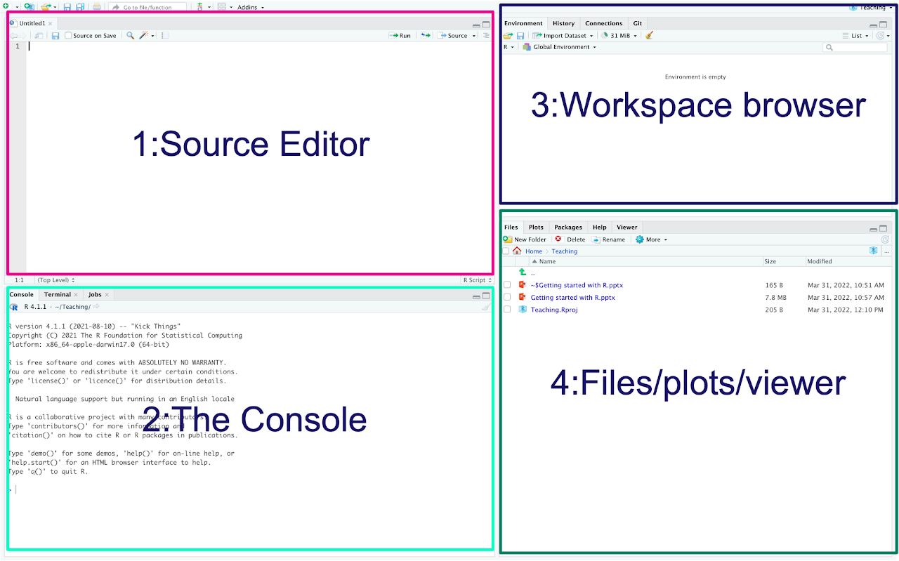
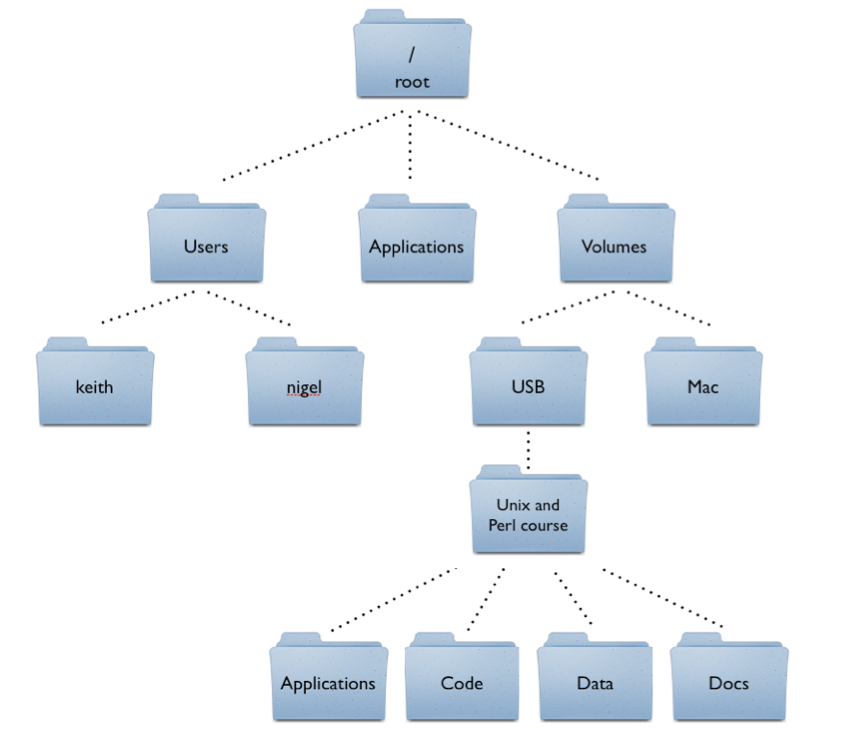

```{r setup, include=FALSE}
knitr::opts_chunk$set(echo = TRUE)
library(here)
library(tidyverse)
```

# Welcome to R for Communication Research!

Welcome to the second day of Jumpstart! Today we'll introduce you to R and RStudio - tools that will help you analyze communication data throughout your graduate studies.

## Today's Learning Goals:

-   Familiarize yourself with RStudio's interface
-   Learn basic R commands and operations
-   Understand fundamental data types and structures
-   Practice with communication research examples

Many of our lessons are inspired by *R for Data Science*. Check it out here: <https://r4ds.hadley.nz/>

## RStudio Interface



**RStudio has four main panels:**

1.  **Source Editor (Top Left)**
    -   Where you write and save your R code (.R files and .Rmd files)
    -   Think of this as your "notebook" for analysis
2.  **Console (Bottom Left)**
    -   Executes code immediately but doesn't save it
    -   Shows output from your code
    -   Good for quick calculations and testing
3.  **Environment/History (Top Right)**
    -   Shows all your data objects and variables
    -   Think of this as your "workspace inventory"
4.  **Files/Plots/Help (Bottom Right)**
    -   **Plots**: Where your visualizations appear
    -   **Files**: Navigate your project folders
    -   **Help**: Documentation for functions

------------------------------------------------------------------------

# Basic R Operations

R works like a powerful calculator, but it can also store results for later use.

## Arithmetic Operations

```{r}
# Basic math operations
100 + 50    # Addition - maybe survey responses
200 - 75    # Subtraction - calculating difference scores
15 * 8      # Multiplication - scaling survey items
120 / 4     # Division - calculating averages
3^2         # Exponentiation - calculating effect sizes
```

## Storing Results in Objects

One of R's most powerful features is storing results in objects:

```{r}
# Store a value for later use
total_participants <- 150
response_rate <- 0.75
actual_responses <- total_participants * response_rate

print(actual_responses)
```

## Object-Oriented Programming in R

R is object-oriented, meaning it stores data and functions together in organized structures. This makes your code more organized and reusable - perfect for research workflows!

------------------------------------------------------------------------

# R Operators Reference

## Arithmetic Operators

```{r}
# Communication research example: Survey scoring
raw_score <- 35
max_possible <- 50

raw_score + 5       # Addition: bonus points
max_possible - 5    # Subtraction: adjusted maximum  
raw_score * 2       # Multiplication: doubling scores
raw_score / 5       # Division: creating subscales
raw_score^2         # Exponentiation: quadratic relationships
raw_score %% 7      # Modulus: grouping participants
raw_score %/% 7     # Integer division: number of complete groups
```

## Comparison Operators

These return TRUE or FALSE - essential for filtering data:

```{r}
# Examples with communication variables
media_usage_hours <- 4.5
social_media_posts <- 12

media_usage_hours == 5      # Equal to: FALSE
media_usage_hours != 5      # Not equal to: TRUE  
social_media_posts > 10     # Greater than: TRUE
media_usage_hours < 3       # Less than: FALSE
social_media_posts >= 12    # Greater than or equal: TRUE
media_usage_hours <= 4      # Less than or equal: FALSE
```

## Logical Operators

Combine conditions - useful for complex data filtering:

```{r}
high_engagement <- TRUE
frequent_user <- FALSE

high_engagement & frequent_user   # AND: both must be true
high_engagement | frequent_user   # OR: either can be true  
!high_engagement                  # NOT: opposite of the value
high_engagement && frequent_user  # Logical AND (for single values)
high_engagement || frequent_user  # Logical OR (for single values)
```

------------------------------------------------------------------------

# Data Types in R

Understanding data types is crucial for communication research analysis:

## 1. Logical (TRUE/FALSE)

Perfect for yes/no questions, experimental conditions:

```{r}
completed_survey <- TRUE
control_group <- FALSE
consent_given <- TRUE

# Example: filtering participants
age <- 22
eligible <- age >= 18  # Returns TRUE if 18 or older
print(eligible)
```

## 2. Numeric (Numbers)

For measurements, scales, counts:

```{r}
# Survey responses on 7-point scales
attitude_score <- 5.2
credibility_rating <- 6.8  
years_experience <- 3

# Check data type
typeof(attitude_score)
```

## 3. Character (Text)

For names, categories, open-ended responses:

```{r}
participant_id <- "P001"
media_type <- "social media"
response_text <- "I think social media influences political opinions"

typeof(participant_id)
```

**Important:** Numbers in quotes become character data!

```{r}
age_numeric <- 25      # This is a number
age_character <- "25"  # This is text that looks like a number

typeof(age_numeric)
typeof(age_character)
```

------------------------------------------------------------------------

# Data Structures

## Vectors: Lists of the Same Data Type

Vectors are fundamental in R - think of them as a column in your dataset:

```{r}
# Likert scale responses (1-7)
trust_scores <- c(6, 4, 7, 5, 3, 6, 7)

# Media platforms used
platforms <- c("Facebook", "Instagram", "Twitter", "TikTok")

# Experimental conditions  
conditions <- c(TRUE, FALSE, TRUE, FALSE, TRUE)

print(trust_scores)
print(platforms)
```

## Data Frames: The Heart of Research Data

Data frames are like spreadsheets - rows are participants, columns are variables:

```{r}
# Create a small communication research dataset
participant_data <- data.frame(
  id = c("P001", "P002", "P003", "P004"),
  age = c(22, 19, 25, 21),
  media_trust = c(4.2, 6.1, 3.8, 5.5),
  platform = c("Instagram", "Facebook", "TikTok", "Twitter"),
  daily_use_hours = c(3.5, 1.2, 4.8, 2.1)
)

print(participant_data)
```

This is how most of your research data will look in R!

## Matrices: Same Data Type in Rows and Columns

Less common in social science, but useful for certain analyses:

```{r}
# Communication effectiveness ratings across different channels
# Rows: different messages, Columns: different channels
effectiveness_scores <- matrix(
  c(6.2, 5.8, 7.1, 4.9,  # Message 1 ratings
    5.5, 6.3, 6.8, 5.2,  # Message 2 ratings  
    7.0, 6.9, 7.3, 6.1), # Message 3 ratings
  nrow = 3, 
  byrow = TRUE
)

# Add meaningful labels
colnames(effectiveness_scores) <- c("Email", "Social", "Video", "Podcast")
rownames(effectiveness_scores) <- c("Message_1", "Message_2", "Message_3")

print(effectiveness_scores)
```

------------------------------------------------------------------------

# Functions in R

Functions are pre-built tools that perform specific tasks. You've already used several!

## What We've Already Used:

-   `c()` - combine values into a vector
-   `typeof()` - check data type\
-   `data.frame()` - create a data frame
-   `matrix()` - create a matrix

## Common Research Functions:

```{r}
# Using our trust scores from earlier
trust_scores <- c(6, 4, 7, 5, 3, 6, 7)

mean(trust_scores)    # Calculate average trust
sum(trust_scores)     # Total of all scores  
sort(trust_scores)    # Sort from low to high
max(trust_scores)     # Highest score
min(trust_scores)     # Lowest score
length(trust_scores)  # How many responses
```

## Getting Help with Functions

Always use `help()` or `?` to learn about functions:

```{r}
help(mean)  # or ?mean
```

## Essential Data Exploration Functions:

```{r}
# Using our participant data from earlier
head(participant_data)      # First few rows
tail(participant_data)      # Last few rows  
str(participant_data)       # Structure of the data
summary(participant_data)   # Basic statistics
```

## Creating Your Own Functions

Sometimes you need custom calculations for your research:

```{r}
# Function to convert 7-point scale to percentage
scale_to_percent <- function(score, max_scale = 7) {
  percentage <- (score / max_scale) * 100
  return(percentage)
}

# Test it
trust_percentage <- scale_to_percent(5.2)
print(trust_percentage)
```

------------------------------------------------------------------------

# Practice Exercises

Let's practice with communication research scenarios!

## Exercise 1: Comparison Operators

Assign these values and test the comparisons:

```{r}
facebook_users <- 150
instagram_users <- 200

# Your code here - test these relationships:
# 1. Are Facebook and Instagram users equal?
# 2. Are they not equal?
# 3. Does Instagram have more users?
# 4. Does Facebook have fewer users?
# 5. Does Instagram have at least 150 users?
# 6. Does Facebook have 150 or fewer users?

```

## Exercise 2: Calculate Survey Statistics

Calculate the mean of these media credibility scores (1-10 scale):

```{r}
credibility_scores <- c(7.2, 5.8, 8.1, 6.4, 4.9, 7.7, 6.3, 8.5)

# Your code here: calculate the mean

```

## Exercise 3: Create a Research Vector

Create a character vector with different news sources and print the third source:

```{r}
# Your code here: create 'news_sources' vector with at least 5 sources
# Then print the third element

```

## Exercise 4: Build a Data Matrix

Create a matrix showing social media engagement across platforms:

```{r}
# Create a 3x4 matrix with engagement numbers
# Rows: different content types (posts, stories, reels)  
# Columns: different platforms
# Your code here:

```

## Exercise 5: Custom Function Challenge

Create a function that calculates response rate (completed/total \* 100):

```{r}
# Your code here: create response_rate() function
# Test it with: 85 completed out of 120 total surveys

```

------------------------------------------------------------------------

# 🔄 BREAK TIME!

*Stretch, grab some water, and get ready for Part 2!*

------------------------------------------------------------------------

# Part 2: Working with External Data

Now that you understand R basics, let's work with actual research data! This is where R really shines.

## File Organization and the `here` Package

Before we dive into data, let's talk about file organization. Good organization is crucial for reproducible research!

### Understanding File Directories

File directories (folders) organize your files in a hierarchical structure:



Think of it like a filing cabinet: - **Root directory** = the entire filing cabinet\
- **Folders** = individual drawers - **Files** = documents in those drawers

### Working Directory in R

Your **working directory** is the folder R is currently "looking at." It's like having one drawer open - R can easily access files in that drawer.

You can check your current working directory by typing:

```{r}
getwd()  # "get working directory"
```

This will show you the full path to where R is currently looking for files. If you need to change your working directory, you can use:

```{r}
# setwd("path/to/your/project")  # "set working directory"
# But we'll use the here package instead for better practice!
```

### The `here` Package Solution

The `here` package solves a common problem: making sure your code works on any computer, regardless of where the project folder is stored.

```{r}
# Without here (problematic):
# data <- read_csv("/Users/hannah/Documents/research/data/survey.csv")  # Won't work on other computers!

# With here (better):
# data <- read_csv(here("data", "survey.csv"))  # Works anywhere!
```

The `here` package automatically finds your project root and builds paths from there.

------------------------------------------------------------------------

# Reading External Data Files

Most communication research involves analyzing data from surveys, experiments, or content analysis. Let's learn how to import this data into R!

## Using read_csv() for Data Import

The `read_csv()` function (from tidyverse) is our go-to for importing data:

```{r}
# Read in communication research data
comm_survey <- read_csv(here("data", "communication_survey.csv"))

# Pro tip: Use tab completion!
# Type read_csv(here("data", then press TAB to see available files
```

Let's work with a fake dataset about media consumption and trust:

```{r}
# For this example, we'll use a media trust survey dataset
media_data <- read_csv(here("data", "media_trust_survey.csv"))

# Quick peek at our data
head(media_data)
```

## Exploring Your Data

Once you've imported data, always explore it first:

```{r}
# Quick exploration commands
glimpse(media_data)        # Overview of all variables
summary(media_data)        # Basic statistics
names(media_data)          # Variable names
nrow(media_data)          # Number of participants
ncol(media_data)          # Number of variables

# Look at specific variables
media_data$trust_score     # Use $ to access individual columns
```

------------------------------------------------------------------------

# R Packages: Expanding Your Toolkit

## What Are R Packages?

R packages are collections of functions created by other researchers and developers. Think of them as specialized toolkits:

-   **Base R** = basic toolkit (comes with R)
-   **Packages** = specialized tools for specific tasks

## Installing and Loading Packages

```{r}
# Install a package (only do this once per computer)
# install.packages("tidyverse")

# Load a package (do this every R session)
library(tidyverse)

# You can also load specific packages
library(dplyr)    # Data manipulation
library(ggplot2)  # Data visualization  
library(readr)    # Reading data files
```

**Key difference:** - `install.packages()` = buying the tool (once) - `library()` = taking the tool out of the toolbox (every session)

------------------------------------------------------------------------

# Introduction to the Tidyverse

The **Tidyverse** is a collection of packages designed specifically for data science. It's incredibly popular in communication research because it makes data analysis more intuitive.

## Core Tidyverse Packages:

-   `dplyr` - data manipulation
-   `ggplot2` - data visualization\
-   `readr` - reading data files
-   `tidyr` - data tidying
-   `purrr` - functional programming

## Tidy Data Principles

"Tidy data" follows three rules that make analysis easier:

1.  **Each variable has its own column** (e.g., age, gender, trust_score)
2.  **Each observation has its own row** (e.g., each participant)\
3.  **Each value has its own cell** (e.g., one trust score per cell)


**Why does this matter?** Tidy data works seamlessly with tidyverse functions, making your analysis faster and more reliable.

------------------------------------------------------------------------

# Data Manipulation with dplyr

The `dplyr` package provides intuitive "verbs" for data manipulation. Let's explore them with communication research examples!

## The Pipe Operator: %\>%

The pipe (`%>%`) lets you chain operations together. Read it as "then":

```{r}
# Without pipes (hard to read):
result <- summarize(filter(select(media_data, age, trust_score), age > 25), mean_trust = mean(trust_score))

# With pipes (much clearer!):
result <- media_data %>%
  select(age, trust_score) %>%
  filter(age > 25) %>%
  summarize(mean_trust = mean(trust_score))
```

## select(): Choose Your Variables

Use `select()` to pick specific columns for analysis:

```{r}
# Select key variables for analysis
core_variables <- media_data %>%
  select(participant_id, age, gender, news_source, trust_score, credibility_rating)

# Select ranges of variables
demographic_vars <- media_data %>%
  select(participant_id:gender)  # All columns from participant_id to gender

# Note: You can also remove unwanted variables with a minus sign
# clean_data <- media_data %>%
#   select(-age)  # This would remove these columns
```

## filter(): Choose Your Observations

Use `filter()` to select specific rows based on conditions:

```{r}
# Filter for specific age groups
young_adults <- media_data %>%
  filter(age >= 18 & age <= 25)

# Filter for high trust scores
high_trust <- media_data %>%
  filter(trust_score > 6)

# Filter for specific news sources
social_media_users <- media_data %>%
  filter(news_source %in% c("Facebook", "Instagram", "Twitter"))

# Multiple conditions
target_group <- media_data %>%
  filter(age >= 18 & age <= 35 & trust_score > 5)

nrow(target_group)  # How many participants meet our criteria?
```

## mutate(): Create New Variables

Use `mutate()` to create new columns or modify existing ones:

```{r}
# Create age categories
categorized_data <- media_data %>%
  mutate(
    age_group = case_when(
      age < 25 ~ "Young Adult",
      age >= 25 & age < 45 ~ "Adult", 
      age >= 45 ~ "Older Adult"
    ),
    # Convert 7-point scale to percentage
    trust_percent = (trust_score / 7) * 100,
    # Create high/low trust categories
    trust_category = ifelse(trust_score > 4, "High Trust", "Low Trust")
  )

# View the new variables
categorized_data %>%
  select(age, age_group, trust_score, trust_percent, trust_category) %>%
  head()
```

## summarize() and group_by(): Calculate Statistics

These functions work together to calculate summary statistics:

```{r}
# Overall statistics
overall_stats <- media_data %>%
  summarize(
    mean_trust = mean(trust_score, na.rm = TRUE),
    median_age = median(age, na.rm = TRUE),
    total_participants = n()
  )

# Statistics by group
trust_by_source <- media_data %>%
  group_by(news_source) %>%
  summarize(
    mean_trust = mean(trust_score, na.rm = TRUE),
    median_trust = median(trust_score, na.rm = TRUE),
    participant_count = n(),
    .groups = 'drop'  # Removes grouping
  )

print(trust_by_source)
```

## arrange(): Sort Your Data

Use `arrange()` to sort rows:

```{r}
# Sort by trust score (lowest to highest)
sorted_data <- media_data %>%
  arrange(trust_score)

# Sort by trust score (highest to lowest)  
sorted_desc <- media_data %>%
  arrange(desc(trust_score))

# Sort by multiple variables
multi_sort <- media_data %>%
  arrange(news_source, desc(trust_score))

head(sorted_desc)
```

------------------------------------------------------------------------

# Practice Exercises: Communication Research Analysis

Let's practice with a fake dataset about social media usage and political engagement!

## Exercise 1: Data Import and Exploration

Read in the social media dataset and explore its structure:

```{r}
# Read in the dataset
# social_media_data <- read_csv(here("data", "social_media_engagement.csv"))

# Explore the data structure
# Your code here: use glimpse(), summary(), and head()

```

## Exercise 2: Variable Selection

Select only the variables related to platform usage and engagement:

```{r}
# Select: user_id, platform, daily_hours, posts_per_week, engagement_score
# Your code here:

```

## Exercise 3: Filtering Data

Filter for users who spend more than 2 hours per day on social media:

```{r}
# Your code here:

```

## Exercise 4: Creating Categories

Create a new variable that categorizes users as "Light," "Moderate," or "Heavy" users based on daily hours:

```{r}
# Use mutate() and case_when():
# Light: < 1 hour, Moderate: 1-3 hours, Heavy: > 3 hours
# Your code here:

```

## Exercise 5: Group Analysis

Calculate the average engagement score by platform:

```{r}
# Your code here: use group_by() and summarize()

```

## Exercise 6: Sorting and Rankings

Sort platforms by average engagement score (highest to lowest):

```{r}
# Your code here: use arrange() with desc()

```

## Exercise 7: Complex Analysis

Find the top 3 platforms with highest engagement among heavy users:

```{r}
# Hint: combine filter(), group_by(), summarize(), arrange(), and head()
# Your code here:

```

## Exercise 8: Creating Summary Statistics

Create a comprehensive summary table showing platform statistics:

```{r}
# Calculate: mean daily hours, mean engagement, user count, and percentage of heavy users
# Your code here:

```

------------------------------------------------------------------------

# Next Steps and Best Practices

Congratulations! You've now learned the fundamentals of R and data manipulation. Here are some best practices for your research:

## Project Organization Tips:

```         
your_project/
├── data/           
  ├── raw/          # Raw data files
  ├── processed/    # Clean data files
├── scripts/        # R scripts  
├── output/         # Results, plots, tables
└── README.md       # Project description
```

## Code Style Guidelines:

-   Use meaningful variable names (`trust_score` not `x1`)
-   Comment your code extensively using # 
-   Use consistent spacing and indentation
-   Break complex operations into smaller steps

## What You've Accomplished Today:

✅ **Session 1:** R basics, data types, functions\
✅ **Session 2:** Data import, tidyverse, data manipulation\
✅ **Bonus:** File organization and project management

## Coming Up:

-   Statistical analysis techniques\
-   Data visualization with ggplot2

## Resources for Continued Learning:

-   [R for Data Science](https://r4ds.hadley.nz/) - Comprehensive guide
-   [Tidyverse documentation](https://www.tidyverse.org/) - Package references
-   [RStudio Cheatsheets](https://www.rstudio.com/resources/cheatsheets/) - Quick references

**Remember:** The best way to learn R is by practicing with your own research questions and data!
